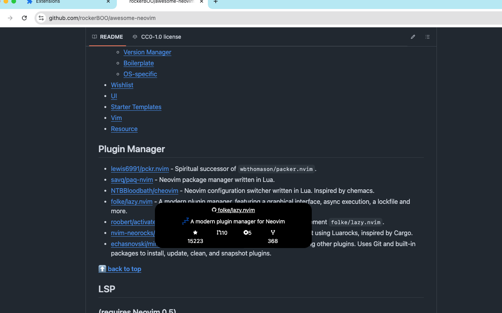

# repo-glance

A tiny chrome extension that shows github repository metadata as a popup

### How to install

- Download the latest release and unzip
- go to firefox://addons or chrome://extensions, turn on developer mode
- Load unpacked and navigate to the unzipped folder

#### Development

Based on the [plasmo](https://docs.plasmo.com) framework

#### TODO

- [x] (Perf) Move to gh graphql api
- [x] delegate extra work to service workers
- [x] Firefox support
- [ ] Font size range picker

### Contributing

PRs are welcome :)
